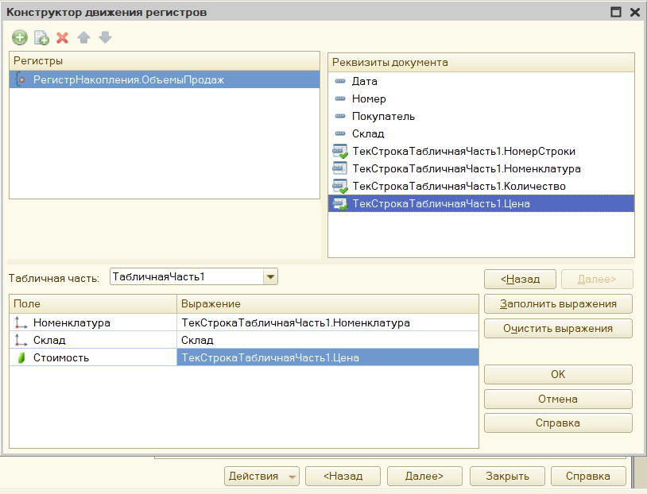
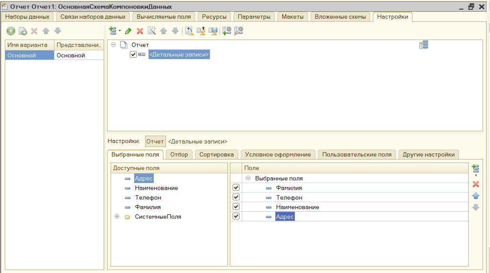

Лабораторная работа №3 “Документы, регистры, отчет (СКД)”

Задание №1 “Документы”:
1. Создание документов:
 a. Создать документ прихода с указанными реквизитами и табличной частью (см Вашу тему ЛР).
  
 b. Создать документ списания денежных средств с указанными реквизитами (см Вашу тему ЛР).
  
2. Механизм «Ввод на основании». 
 a. Связать документ списания денежных средств с документом прихода посредством ввода на основании.
  
3. Создание документов продажи путем копирования документов закупки и минимального редактирования. 
 a. Создать путем копирования документ расхода и документ поступления денежных средств (см Вашу тему ЛР)
  

4. Объединение документов в журналы. 
 a. Создайте журнал (см Вашу тему ЛР), объединив документы поступления и списания денежных средств. Задание №2 “Регистры”:
  
  
  

Продемонстрируйте созданные объекты скриншотами.

Задание №2 “Регистры”
1. Создание регистра сведений
  
 a. Заполните регистр данными в режиме предприятия
  
  

 b. Создание регистра накопления и связывание документов и регистров, использование конструктора движений. (см Вашу тему ЛР):
	Создать движения для документа в регистре накопления через конструктор
	Создать перечисление “Вид номенклатуры”. В перечислении создать два возможных варианта: “товар” и “услуга” (у кого только услуги или товары нужно создать варианты “бесплатный товар” или “бесплатная услуга”). В справочнике с товарами и/или услугами добавить реквизит “Вид номенклатуры”. Для существующих в базе позиций указать вид товара. Указать либо создать хотя бы одну позицию с видом “услуга”. В обработке проведения документа прихода дописать код, пропускающий проведение конкретной позиции, если её вид - услуга.
	Продемонстрируйте созданные объекты скриншотами.

Задание №3 “Отчеты
1. Создайте отчёт. В свойствах отчёта на вкладке “Основные” нажмите кнопку “открыть схему компоновки данных”. В конструкторе сформируйте запрос к справочнику указанному в вашей теме. Набор реквизитов определите самостоятельно. 
Настройте отчёт таким образом, чтобы он выводил список контрагентов/поставщиков/покупателей с реквизитами и упорядочивал их по наименованию.
Продемонстрируйте созданные объекты скриншотами.

